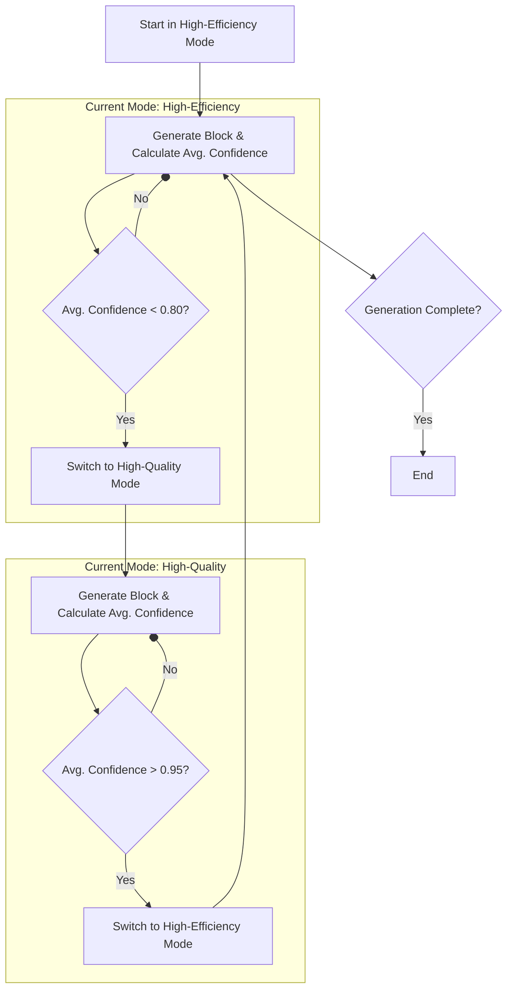

# Self-Correcting Adaptive Inference Scheduling for Diffusion LLMs

A novel, training-free inference optimization framework that makes diffusion-based Large Language Models dynamically adapt their generation strategy in real-time. Instead of continuous parameter adjustments, this approach switches between two distinct generation modes: **High-Efficiency** and **High-Quality**.

## 🎯 Overview

Traditional Fast-dLLM approaches rely on static hyperparameters (fixed block size `B` and confidence threshold `τ`) that remain constant throughout the entire generation process. However, text generation naturally has phases of varying difficulty.

**Self-Correcting Adaptive Inference Scheduling** introduces a framework that switches between two pre-defined operational modes based on real-time model confidence, enabling:

- **Dual-Mode Strategy**: Switches between a `High-Efficiency` mode for confident predictions and a `High-Quality` mode for uncertain regions.
- **Stable Configuration**: Avoids parameter oscillation by using fixed, optimized settings for each mode.
- **Hysteresis-based Switching**: Prevents rapid, unstable mode changes through a robust transition logic.
- **Tiered Cache Management**: Intelligent cache update strategy that reduces computational redundancy.

## 🏗️ Architecture

### Core Components

```
┌─────────────────────────────────────────────────────────────┐
│                AdaptiveInferenceScheduler                    │
│  ┌────────────────────────┐   ┌────────────────────────┐     │
│  │   High-Efficiency Mode   │   │    High-Quality Mode     │     │
│  │                        │   │                        │     │
│  │ - Large Block Size     │   │ - Small Block Size     │     │
│  │ - Lower τ for Speed    │   │ - Higher τ for Accuracy│     │
│  └────────────────────────┘   └────────────────────────┘     │
│                  ▲                                  │     │
│                  │ (Confidence > 0.95)              │     │
│                  ▼                                  │     │
│  ┌────────────────────────┐                          │
│  │   Mode Transition Logic  │                          │
│  │ (Moving Avg. Confidence)│                          │
│  └────────────────────────┘                          │
└─────────────────────────────────────────────────────────────┘
```

### Adaptive Logic Flow

The system uses a hysteresis mechanism to ensure stable transitions between modes.



## 🔧 Technical Approach

### 1. Dual-Mode Configuration

The core of the system is two distinct, pre-configured modes for generation.

| Mode | Block Size `B` | Confidence `τ` | Goal |
|---|---|---|---|
| **High-Efficiency** | 32 | 0.75 | Maximize throughput on predictable text |
| **High-Quality** | 8 | 0.95 | Maximize accuracy on complex or uncertain text |

This eliminates the overhead and instability of continuous, fine-grained parameter tuning.

### 2. Hysteresis-based Mode Switching

To prevent the system from oscillating rapidly between modes, we use a transition logic with a dead zone (hysteresis).

```python
# The system switches from High-Efficiency to High-Quality
# only when confidence drops below a low threshold.
if current_mode == 'High-Efficiency' and avg_confidence < 0.80:
    current_mode = 'High-Quality'

# It only switches back when confidence significantly recovers,
# surpassing a much higher threshold.
elif current_mode == 'High-Quality' and avg_confidence > 0.95:
    current_mode = 'High-Efficiency'
```
This ensures that the mode changes only when there is a clear and sustained shift in model confidence.

### 3. Tiered Cache Management

A novel three-tier cache system that eliminates redundant recomputation:

| Tier | Content | Update Policy | Purpose |
|------|---------|---------------|---------|
| **Tier 1 (Frozen)** | Prompt tokens | Once, never updated | Eliminate prompt recomputation |
| **Tier 2 (Stable)** | High-confidence generated blocks | Infrequent updates | Reduce stable content overhead |
| **Tier 3 (Active)** | Recent/uncertain blocks | Every step | Maintain accuracy for dynamic content |

**Benefits:**
- Dramatically reduces cache update overhead for long sequences
- Maintains accuracy where it matters most
- Scales efficiently with sequence length

## 🚀 Key Features

### ✨ Training-Free
- No model retraining required
- Works with any pre-trained diffusion LLM
- Plug-and-play optimization

### 📊 Real-Time Adaptation
- Stable mode switching based on model confidence
- Robust against parameter oscillation
- Self-correcting behavior at a strategic level

### 🎯 Task-Agnostic
- Adapts to math, code, creative writing, QA
- No manual task-specific tuning
- Robust across diverse content types

### ⚡ Performance Optimized
- Reduced computational redundancy
- Intelligent resource allocation
- Aims for a superior accuracy-throughput frontier

## 📈 Performance Goals

This new approach is designed to outperform both static methods and fine-grained adaptive methods.

| Metric | Target Improvement vs Static Fast-dLLM |
|--------|--------------------------------|
| **Throughput (easy content)** | +15-25% |
| **Accuracy (complex reasoning)** | +5-12% |
| **NFE Reduction** | -10-20% |
| **Long-sequence scaling** | +20-35% |

### Accuracy vs Throughput Frontier

```
Accuracy ↑
    │
    │    ● Adaptive Mode-Switching (Target)
    │   ╱
    │  ╱
    │ ╱ ● Static Fast-dLLM (B=32, τ=0.9)
    │╱
    │─────────────────────── → Throughput
```

## 🛠️ Usage

### Basic Usage

The new simplified API focuses on enabling the scheduler.

```python
from generate import generate_with_adaptive_scheduling
from model.modeling_llada import LLaDAModelLM

# モデルの初期化
model = LLaDAModelLM.from_pretrained('GSAI-ML/LLaDA-8B-Instruct')
tokenizer = AutoTokenizer.from_pretrained('GSAI-ML/LLaDA-8B-Instruct')

# アダプティブスケジューリングで生成
output, metrics = generate_with_adaptive_scheduling(
    model=model,
    prompt=input_ids,
    gen_length=128,
    enable_tiered_cache=True     # 階層キャッシュ有効化
)

# 適応メトリクスの表示
print(f"Average block size: {metrics['avg_block_size']:.1f}")
print(f"Mode changes: {metrics['total_adaptations']}")
```

### Advanced Configuration

You can customize the mode parameters and transition thresholds.

```python
# 詳細設定でのアダプティブスケジューリング
from adaptive_scheduler import AdaptiveInferenceScheduler
from cache_manager import TieredCacheManager

scheduler_config = {
    'to_quality_threshold': 0.80,
    'to_efficiency_threshold': 0.95,
    'confidence_window_size': 2,
    'high_efficiency_params': {'block_size': 32, 'threshold': 0.75},
    'high_quality_params': {'block_size': 8, 'threshold': 0.95}
}

# カスタムスケジューラーで生成
output, detailed_metrics = generate_with_adaptive_scheduling(
    model=model,
    prompt=input_ids,
    scheduler_config=scheduler_config
)
```

## 📊 Evaluation

### Benchmarks

The system will be evaluated on:

- **GSM8K**: Math reasoning tasks
- **HumanEval**: Code generation
- **MBPP**: Programming problems  
- **Long-form QA**: Complex reasoning
- **Creative Writing**: Open-ended generation

### Running Evaluation

```bash
# 基本評価の実行
python test_adaptive_scheduling.py --benchmark gsm8k --model LLaDA-8B

# 包括的評価
python test_adaptive_scheduling.py --comprehensive
```

## 🔬 Research Insights

### Expected Adaptation Patterns

The system is expected to exhibit clear mode-switching patterns:

1.  **Math Problems**: Switch to `High-Quality` for reasoning steps, return to `High-Efficiency` for computation.
2.  **Code Generation**: Use `High-Quality` for complex logic (loops, functions), `High-Efficiency` for boilerplate.
3.  **Creative Writing**: Use `High-Efficiency` for narrative, `High-Quality` for nuanced dialogue.
4.  **Q&A**: Use `High-Quality` for factual retrieval, `High-Efficiency` for explanatory parts.

### Key Hypotheses

- **Stability is Key**: Avoiding parameter oscillation is more important than fine-grained adaptation.
- **Strategic Switching**: A few, well-placed mode shifts yield better results than constant adjustments.
- **Reduced Overhead**: The simpler logic will lead to lower computational overhead and improved NFE.
- **Robustness**: The dual-mode system will be more robust across different tasks and models.

## 🏆 Advantages over Other Approaches

| Aspect | Static Fast-dLLM | Fine-Grained Adaptation | Mode-Switching |
|--------|------------------|---------------------------|-------------------|
| **Strategy** | Fixed (B=32, τ=0.9) | Continuously variable | Dual-Mode |
| **Stability** | High | Potentially Low (oscillates) | High (hysteresis) |
| **Overhead** | Low | High | Medium |
| **Content Awareness** | None | Real-time (micro) | Real-time (macro) |
| **Task Generalization** | Manual tuning | Automatic but sensitive | Automatic and robust |

## 🔮 Future Directions

### Potential Extensions

1.  **More Modes**: Introduce an "ultra-quality" mode for extremely difficult sections.
2.  **Learned Modes**: Use offline analysis to learn the optimal parameters for each mode.
3.  **Distributed**: Adaptive mode-switching across multiple GPUs.
4.  **Hardware-Aware**: Adapt mode parameters to specific hardware constraints.

### Research Opportunities

- **Theoretical Analysis**: Formal bounds on mode-switching vs. static performance.
- **Causality-Aware**: Integrate mode-switching with causal attention mechanisms.
- **Energy Efficiency**: Optimize modes for both speed and power consumption.
- **Human Preference**: Align mode-switching logic with human judgment of difficulty.

## 📚 Citation

```bibtex
@article{adaptive_scheduling_2025,
    title={Self-Correcting Adaptive Inference Scheduling for Diffusion Large Language Models},
    author={[Authors]},
    journal={[Venue]},
    year={2025},
    note={Training-free dynamic optimization for dLLM inference using mode-switching}
}
```

## 📄 License

This project is licensed under the Apache License 2.0 - see the [LICENSE](LICENSE) file for details.

## 🤝 Contributing

Contributions are welcome! Please see [CONTRIBUTING.md](CONTRIBUTING.md) for guidelines.

## 🏷️ Tags

`diffusion-llm` `adaptive-inference` `training-free` `optimization` `scheduling` `mode-switching` `dynamic-generation` 